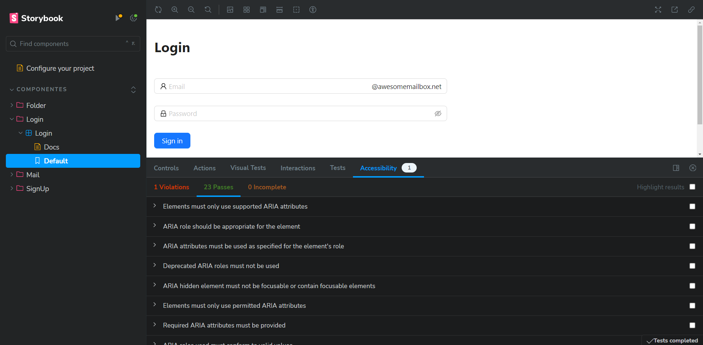
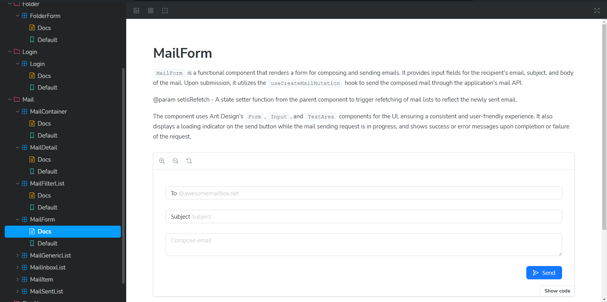
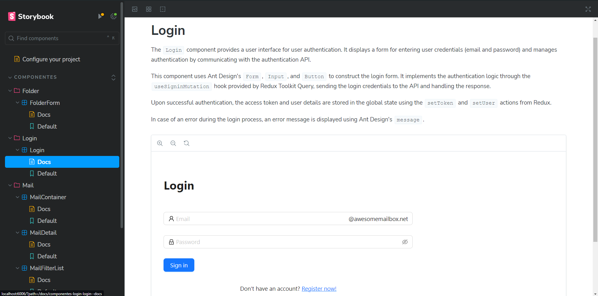

# SnoopJake TEAM CHANGELOG

# Milestone 2. Accords between HomeGroups

To better integrate our projects, we created a table on a Notion page. on which we recopilated our ideas for changes and our progress [Tasks Table](https://www.notion.so/Legacy-Maintainability-4d1286ae270a40febe66bb4e588cdc37?pvs=4)


## SonarCloud code quality fixes

### Maintability Issues

1. On **email-app/Dockerfile**
    > **Replace 'as' with an uppercase format `AS`.**
    -    >This change was made because using uppercase in instructions enhances readability and clarity, especially during collaborations within development teams. Change date: ***17/03/2024***
    > **This line added --ignore-scripts to the RUN npm install command.**
    -    >this change was made so that npm will install the project dependencies, but will not run any scripts defined in the package.json file. Change date: ***17/03/2024***
2.  On **email-app/src/App.tsx**
    >   **Consolidated multiple calls to `./hooks` into a single line.**
    -   >This change was made because importing the same module multiple times affects code readability and maintainability. Change date: ***17/03/2024***
    >  **Removed empty <> </> enclosing the code fragment in the return statement.**
    -    >This change was made because it's redundant in React; if only one element or component is returned, <> </> tags are unnecessary. Change date: ***17/03/2024***
3. On **email-app/src/__test__/Login.test.jsx**
    > **Removed commented-out code.**
    -    >This change was made because commented-out code distracts attention from the code that is actually being executed and increases maintenance overhead. Change date: ***17/03/2024***
4. On **email-app/src/components/Login/Login.tsx**
    > **Removed empty <> </> enclosing the code fragment in the return statement.**
    -    >This change was made because it's redundant in React; if only one element or component is returned, <> </> tags are unnecessary. Change date: ***17/03/2024***
5. On **email-app/src/components/Mail/MailContainer.tsx**
    > **Consolidated multiple calls to `antd` into a single line.**
    -   > This change was made because importing the same module multiple times affects code readability and maintainability. Change date: ***17/03/2024***
6. On **email-app/src/components/Mail/MailGenericList.tsx**
    >   **Consolidated multiple calls to `./hooks` into a single line.**
    -   >This change was made because importing the same module multiple times affects code readability and maintainability. Change date: ***17/03/2024***
7. On **email-app/src/components/SignUpForm/SignUpForm.tsx**
    > **Removed empty <> </> enclosing the code fragment in the return statement.**
    -    >This change was made because it's redundant in React; if only one element or component is returned, <> </> tags are unnecessary. Change date: ***17/03/2024***
     > **Corrected the regex for password validation, as it had unnecessary character escapes triggered by a \.**
    -    >This change was made because in the special characters part [^$*.{}()?"!@#%&/\,><':;|_~], some characters are unnecessarily escaped. Within brackets [], only ^, -, ], and ` need to be escaped. The rest do not need to be escaped. Change date: ***17/03/2024***
6. On **email-app/src/store.ts**
    >Consolidated multiple calls to `@reduxjs/toolkit` into a single line.
    -    >It was changed because importing the same module multiple times affects code readability and maintainability. Change date: ***17/03/2024***

## New features

### Feature 1 -> W3C Standards No Changes
 For this feature we checked the W3C standards to make sure that the page complies with the accessibility requirements, as this is something that all web pages should comply with and it works correctly. We performed several tests, which will be mentioned below along with their respective results:
> Browser Compatibility:
- **Test:** Compatibility was tested with different browsers such as Chrome, Firefox, Brave, Microsoft Edge.</br>
**Result:** The page worked correctly in all tested browsers without any issues.</br>
> Performance and Optimization:
- **Test:** The performance and accessibility standards were tested using Google's Lighthouse extension locally, which analyzes aspects such as Performance, Accessibility, Best Practices, and SEO.</br></br>
**Result 1:** Test #1 was conducted with both desktop (Image 1) and mobile (Image 2) versions of the login component, and we obtained excellent results in accessibility and best practices. Although the performance score was lower, this is likely due to running the test locally. <center></center>
<center>Image 1 y Image 2</center></br>

- **Result 2:** The test #2 was performed with the desktop version (image 1) and mobile version (image 2) of the email component, and we obtained very good results in terms of accessibility and best practices. The performance score was lower, but this is likely due to running the test locally.<center></center>
<center>Image 1 y Image 2</center></br>

> Link Validation:
- **Test:** 
Manually, all links and clickable parts of the page were tested to ensure they functioned correctly.</br>
**Result:** All links work as expected, and those that do not lead anywhere display a 404 error page, which is perfect</br>
> HTML Validation:
- **Test:** Manually, it was tested that the components brought by the page are appropriately named and easily navigable.</br>
**Result:** The page has very adequate tab navigation, allowing smooth movement through all parts of the page without any issues.</br>
> Accessibility testing with Storybook :
- **Test:** The components were tested using Storybook and its accessibility section with the addon called addon a11y - Accessibility.</br>
**Result:** The accessibility tests yielded very good results, as seen in Image 1, where the Login component was analyzed under Storybook's accessibility requirements. It showed 23 passed tests and 1 failed test.<center></center>


### Feature 2 -> Storybook
In this feature, Storybook was implemented, which is a frontend tool that offers various capabilities such as testing, creating and testing components in isolation, and automatically documenting components, among other possibilities.</br>

In the HG-0 project, they had dependencies of Babel installed to use Jest for unit testing. However, with the version `Storybook 8.0.4`  being used, there was a conflict with Babel. This was because earlier versions of Storybook used Babel. The issue was resolved by uninstalling the Babel dependencies and reinstalling Jest without them, as an addon of Storybook. This approach worked as expected.

> Docs:
In this feature, Storybook was implemented, which is a frontend tool that offers various capabilities such as testing and creating components in isolation, as well as automatically documenting components, among other possibilities. In the image below, you can see the MailForm component, which is documented.</br><center></center>
> Preview:
As mentioned earlier, each component has its documentation. However, if you look below the documentation, you can see the rendered document, which refers to the ability to create and test components in isolation. This functionality was successfully implemented into the code.</br><center></center>

## How to run the Storybook

1. Run Storybook:
```bash
npm run storybook
```

This will start Storybook and open your default browser to the Storybook page, where you can view and interact with the components.


### Feature 3 -> Automated Static code review and test coverage with SonarCloud
We implemented a CI workflow that checked the code on Push and Pull Request actions on GitHub.

The overall analysis can be found at https://sonarcloud.io/summary/overall?id=Tech-Fellows-SnoopJake_hg0-emailClient-frontend

On each commit, a SonarCloud badge can be seen, which analyzes how many quality problems were introduced due to that specific commit:


We **succesfully fixed all the vulnerabilities found initially**, **for the 1.8 lines of code analyzed!**


Test coverage was implemented, but no tests exist so coverage is 0%!

///////////////////////////////////////////////////

# Email Client Project
This is the frontend interface for an email client.
Check the backend here (https://github.com/zeldacamila/hg0-emailClient-backend)

## Features

- Basic Email Sending and Receiving
- User Registration and Login System
- Email Organization
- Basic Email Search Functionality
- 
## Technologies Used

- [React](https://react.dev/)
- [Vite](https://vitejs.dev/)
- [Ant Design](https://ant.design/)

## Requirements

- Typescript 5.2.2 or higher
- React 18.2.0 or higher
- Vite 5.1.4 or higher
- Antd 5.14.1 or higher
- Dayjs 1.11.10 or higher
- Reduxjs/toolkit 2.2.1 or higher

## Environment Setup

1. Clone the repository:

```bash
git clone git@github.com:zeldacamila/hg0-emailClient-frontend.git
cd email-app
npm install
npm run dev
```

## Environment Variables
These are only used for the github actions that are implemented on this repo.
To run this project, you will need to add the following environment variables to your github repository. Do not include sensitive information directly in your project files or documentation.

``` bash
DOCKER_USERNAME='your_dockerhub_user'
DOCKER_PASSWORD='your_dockerhub_password'
API_URL='your_api_url'
```

## Usage
- Access http://localhost:5173/ in your browser to interact with the application.
